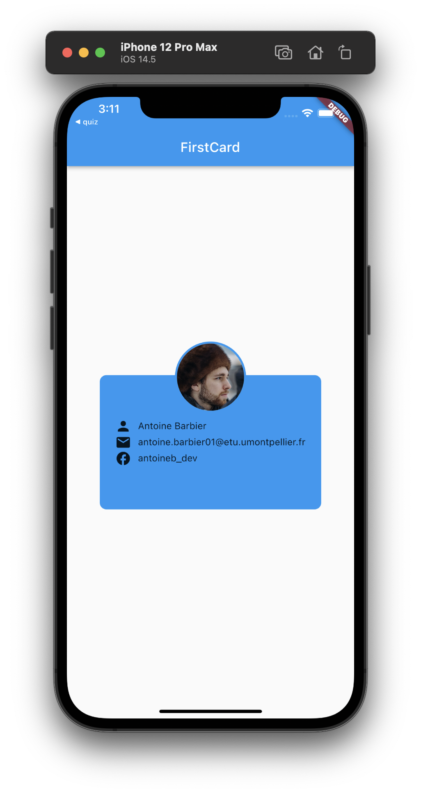
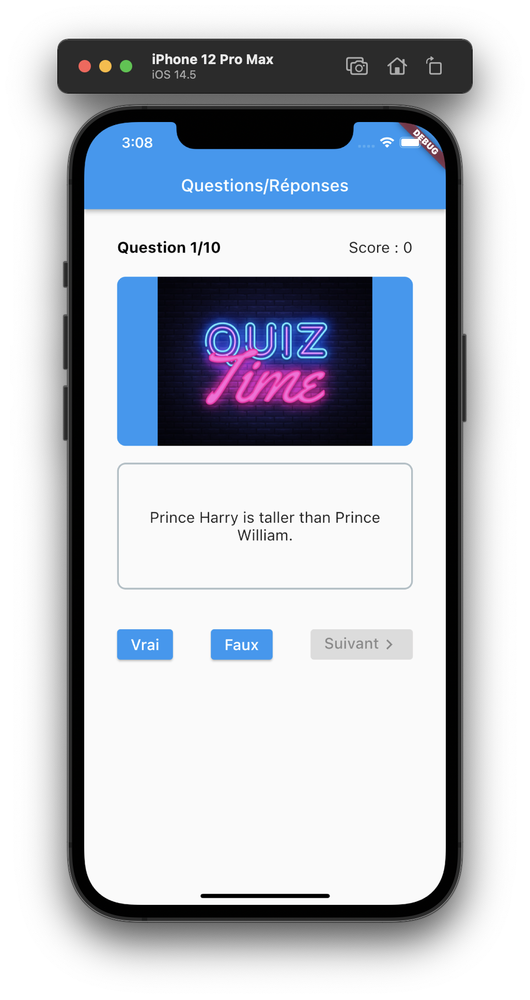
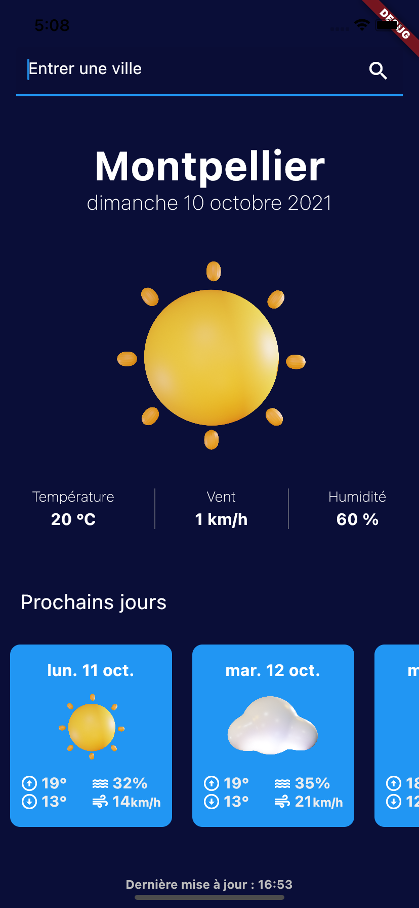
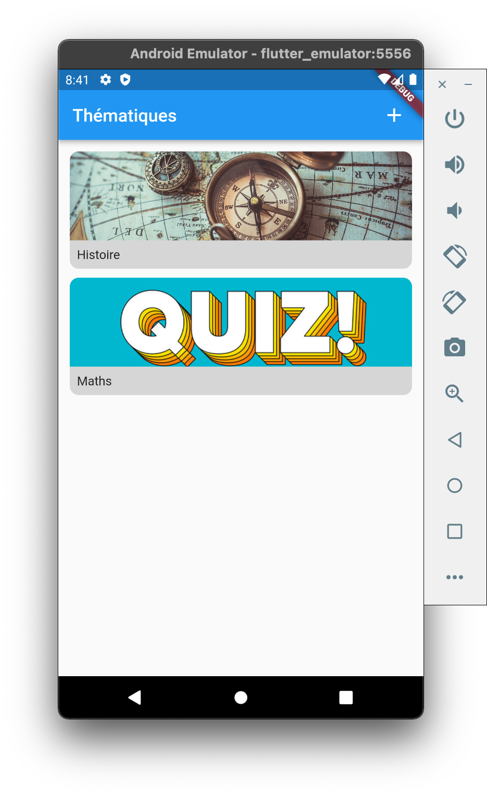
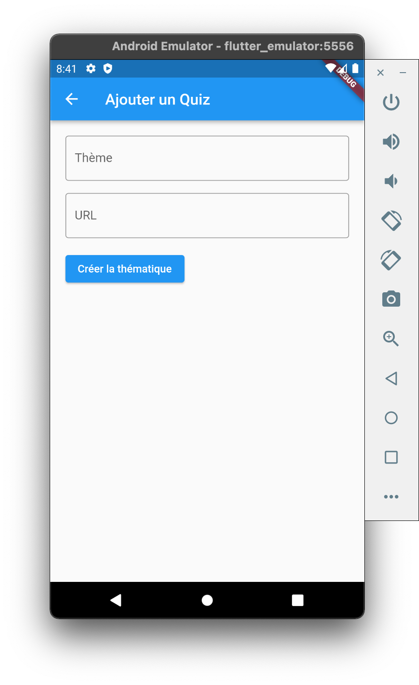
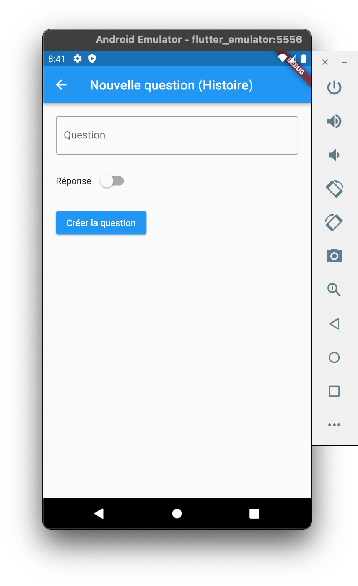
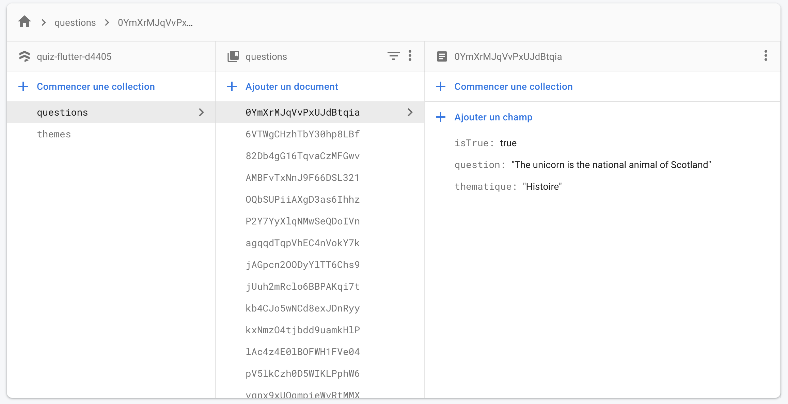
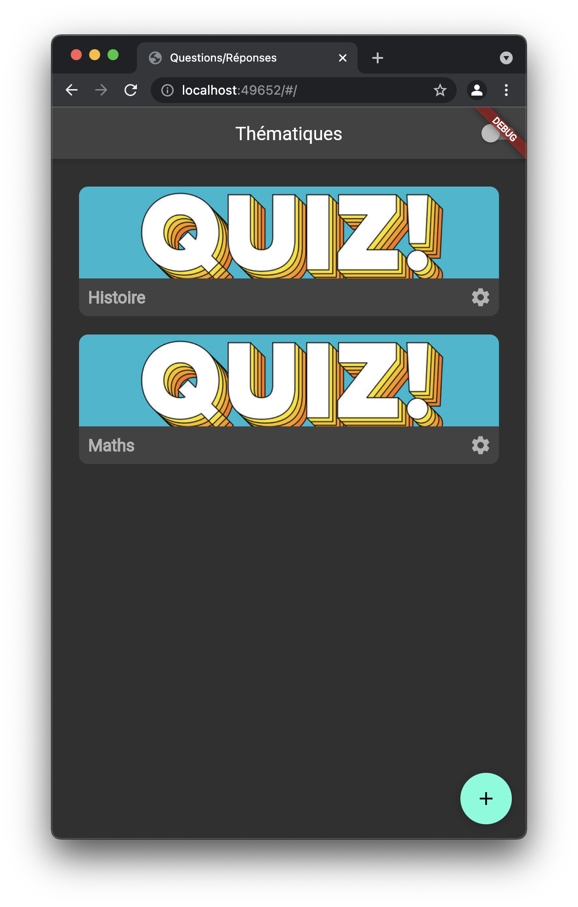
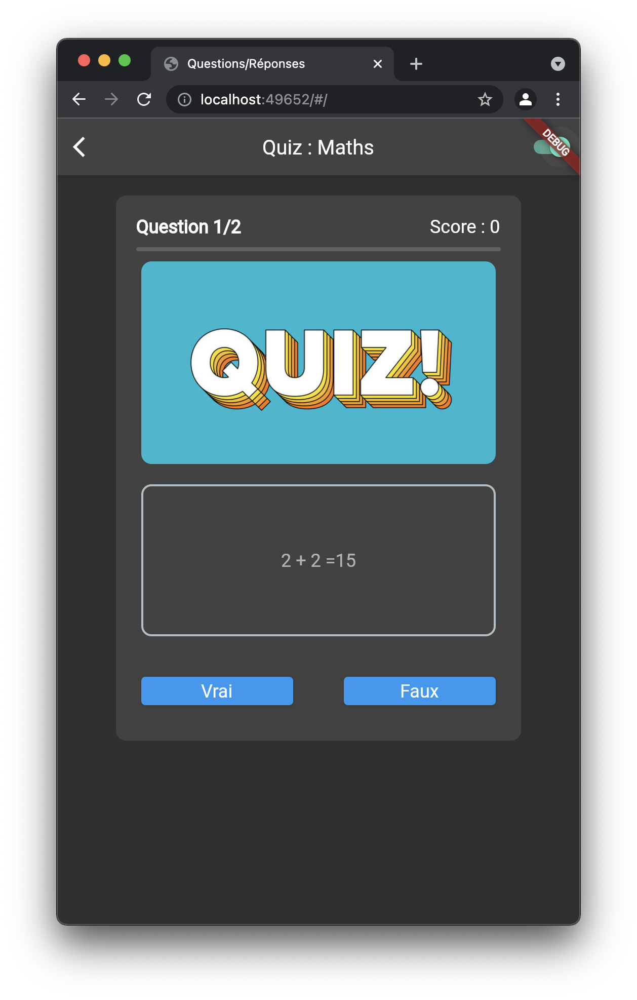
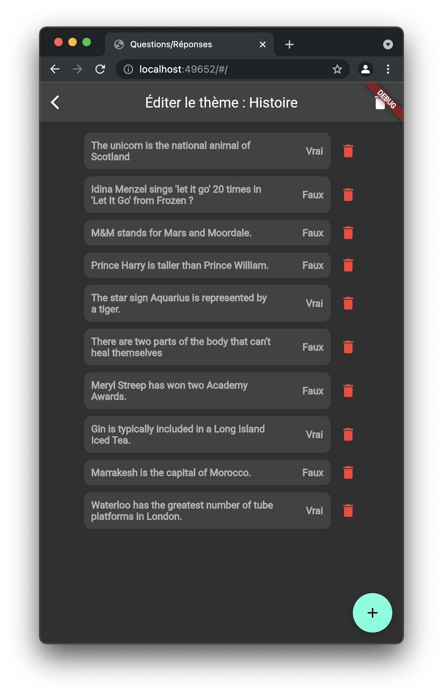

# HAI912I TD Antoine Barbier

## TD1

### Exercice 1

### Exercice 2

## TD2

### Application 2 : Weather App

## TD3

### Amélioration du quiz : Firebase et pattern bloc

## TD4

### Amélioration du quiz : Dark mode + suppression de questions

